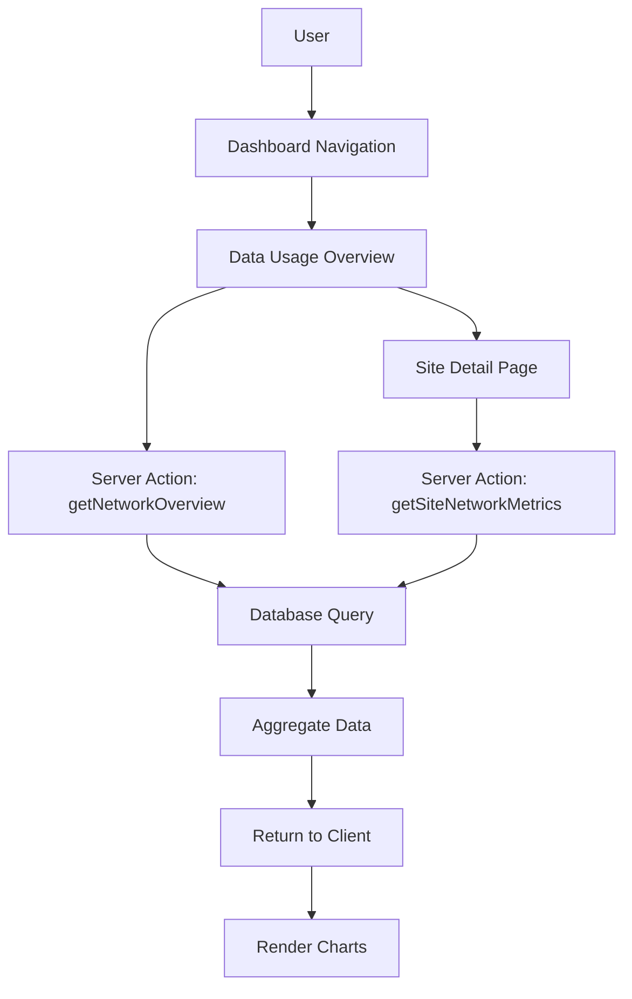

# Data Usage Report Feature - Product Requirements Document

## 1. Executive Summary

The Data Usage Reports feature provides comprehensive network performance analytics for BMS Dashboard sites. Users can view monthly reports showing bandwidth utilization, data consumption, and latency metrics in a Grafana-style visualization interface. This feature enables site administrators to monitor network health, identify usage patterns, and optimize connectivity across their battery monitoring installations.

### Key Deliverables
- New "Data Usage" navigation tab in the dashboard
- Overview page with all sites' network metrics summary
- Detailed site-specific reports with interactive charts
- Historical data for May-November 2024 and February-June 2025
- Grafana-style dark theme visualizations using Recharts

---

## 2. Problem Statement

### Current State
Site administrators currently lack visibility into network performance metrics for their BMS installations. There is no way to:
- Track bandwidth utilization over time
- Monitor data consumption against allowances
- Identify latency issues affecting data transmission
- Compare network performance across sites

### Desired State
A comprehensive data usage reporting system that provides:
- Historical network performance data visualization
- Site-by-site comparison capabilities
- Trend analysis for capacity planning
- Clear indicators of network health and utilization

### Impact
Without network visibility, administrators cannot:
- Optimize bandwidth allocation
- Identify underperforming connections
- Plan for capacity upgrades
- Troubleshoot connectivity issues proactively

---

## 3. Goals and Success Metrics

### Primary Goals
1. Provide complete visibility into site network performance
2. Enable data-driven decisions for network optimization
3. Support historical analysis for trend identification
4. Deliver a professional, Grafana-style reporting experience

### Success Metrics

| Metric | Target | Measurement |
|--------|--------|-------------|
| Page Load Time | < 2 seconds | Performance monitoring |
| Chart Render Time | < 500ms | Performance monitoring |
| User Adoption | 80% of admins use within 30 days | Analytics tracking |
| Data Accuracy | 99.9% match with source data | Automated validation |
| Mobile Responsiveness | Fully functional on tablet | Manual testing |

### Key Performance Indicators (KPIs)
- Number of report views per week
- Average time spent on reports
- Export frequency (CSV/PNG)
- Filter usage patterns

---

## 4. User Stories

### US-001: View Network Overview
**As a** site administrator
**I want to** see a summary of all sites' network performance
**So that** I can quickly identify sites needing attention

**Acceptance Criteria:**
- [ ] Overview page displays cards for all sites
- [ ] Each card shows: site name, avg speed, total consumption, status indicator
- [ ] Cards are sortable by name, consumption, or speed
- [ ] Color-coded status (green/yellow/red) based on utilization
- [ ] Click card to navigate to detailed report

### US-002: View Detailed Site Report
**As a** site administrator
**I want to** view detailed network metrics for a specific site
**So that** I can analyze performance patterns and issues

**Acceptance Criteria:**
- [ ] Speed graph shows upload/download over time
- [ ] Latency graph shows avg/min/max values
- [ ] Consumption chart shows daily/monthly totals
- [ ] All charts support hover tooltips
- [ ] Site name and configuration displayed in header

### US-003: Filter by Date Range
**As a** site administrator
**I want to** select specific date ranges for reports
**So that** I can analyze performance during particular periods

**Acceptance Criteria:**
- [ ] Date range picker with preset options (Last 7 days, Last 30 days, Custom)
- [ ] Supports May-November 2024 and February-June 2025 ranges
- [ ] Charts update dynamically on range change
- [ ] Invalid ranges show appropriate error message

### US-004: Compare Monthly Performance
**As a** site administrator
**I want to** compare network performance month-over-month
**So that** I can identify trends and anomalies

**Acceptance Criteria:**
- [ ] Comparison mode toggle available
- [ ] Side-by-side or overlay chart options
- [ ] Percentage change indicators
- [ ] Export comparison data

### US-005: Export Report Data
**As a** site administrator
**I want to** export report data and charts
**So that** I can share findings and create presentations

**Acceptance Criteria:**
- [ ] Export charts as PNG images
- [ ] Export data as CSV files
- [ ] Include date range and site info in exports
- [ ] Maintain chart styling in PNG exports

### US-006: View Pholela School Special Configuration
**As a** site administrator
**I want to** see Pholela School's 100 Mbps configuration correctly displayed
**So that** I can compare its performance against its higher bandwidth allocation

**Acceptance Criteria:**
- [ ] Pholela School shows 100 Mbps allocated bandwidth
- [ ] Utilization percentage calculated against 100 Mbps
- [ ] Visual indicator of premium connection
- [ ] All other metrics follow standard calculations

---

## 5. Detailed Requirements

### 5.1 Functional Requirements

#### FR-001: Navigation Integration
- Add "Data Usage" item to dashboard sidebar navigation
- Position after existing navigation items
- Use `Network` or `BarChart3` icon from Lucide React
- Highlight when active

#### FR-002: Data Periods
- **Period 1**: May 1, 2024 - November 30, 2024
- **Period 2**: February 1, 2025 - June 30, 2025
- Exclude December 2024 and January 2025
- Show "No data available" for excluded periods

#### FR-003: Site Configurations

| Configuration | Bandwidth | Daily Allowance | Operating Hours |
|--------------|-----------|-----------------|-----------------|
| Default | 15 Mbps up/down | 1 GB | 10:00-18:00 |
| Pholela School | 100 Mbps up/down | 1 GB | 10:00-18:00 |

#### FR-004: Metrics Calculations

**Speed Utilization:**
```
utilization_pct = (actual_speed / allocated_bandwidth) * 100
```

**Data Consumption:**
```
daily_total = sum(hourly_consumption)
monthly_total = sum(daily_totals)
consumption_pct = (actual_consumption / allowance) * 100
```

**Latency Statistics:**
```
avg_latency = mean(latency_readings)
jitter = stddev(latency_readings)
```

#### FR-005: Operating Hours Enforcement
- Only display/calculate data for 10:00-18:00
- Grey out or hide off-hours in time-based charts
- Clearly indicate operating window in UI

### 5.2 Non-Functional Requirements

#### NFR-001: Performance
- Page load: < 2 seconds on 3G connection
- Chart render: < 500ms after data load
- Support 120+ sites without degradation
- Lazy load charts below fold

#### NFR-002: Accessibility
- WCAG 2.1 AA compliance
- Keyboard navigation for all controls
- Screen reader support for charts (aria-labels)
- Color-blind friendly palette

#### NFR-003: Security
- Respect existing role-based access control
- Audit log for report exports
- No PII in exported data

#### NFR-004: Reliability
- Graceful degradation if data unavailable
- Retry logic for failed data fetches
- Offline indicator when disconnected

---

## 6. Technical Architecture

### 6.1 Component Hierarchy

```
app/dashboard/data-usage/
├── page.tsx                    # Overview page (Server Component)
├── loading.tsx                 # Loading skeleton
├── [siteId]/
│   ├── page.tsx               # Site detail page (Server Component)
│   └── loading.tsx            # Loading skeleton
└── components/
    ├── DataUsageNav.tsx       # Navigation item (Client)
    ├── SiteOverviewCard.tsx   # Site summary card (Client)
    ├── SpeedChart.tsx         # Speed time series (Client)
    ├── LatencyChart.tsx       # Latency visualization (Client)
    ├── ConsumptionChart.tsx   # Data consumption chart (Client)
    ├── UsageHeatmap.tsx       # Hour/day heatmap (Client)
    ├── MetricGauge.tsx        # Utilization gauge (Client)
    ├── DateRangePicker.tsx    # Date selection (Client)
    ├── ExportButton.tsx       # Export functionality (Client)
    └── StatPanel.tsx          # Key metrics panel (Client)
```

### 6.2 Data Flow



### 6.3 Server Actions

Location: `app/actions/network-usage.ts`

```typescript
// Get overview data for all sites
export async function getNetworkOverview(
  dateRange: { start: Date; end: Date }
): Promise<SiteNetworkSummary[]>

// Get detailed metrics for a single site
export async function getSiteNetworkMetrics(
  siteId: string,
  dateRange: { start: Date; end: Date }
): Promise<SiteNetworkDetail>

// Get aggregated monthly data
export async function getMonthlyAggregates(
  siteId: string,
  months: string[] // Format: 'YYYY-MM'
): Promise<MonthlyAggregate[]>

// Export data as CSV
export async function exportNetworkData(
  siteId: string,
  dateRange: { start: Date; end: Date },
  format: 'csv' | 'json'
): Promise<string>
```

---

## 7. Database Schema

### 7.1 New Tables

#### network_telemetry
Raw network metrics collected during operating hours.

```typescript
// src/db/schema/network-telemetry.ts

export const networkTelemetry = pgTable('network_telemetry', {
  id: uuid('id').defaultRandom().primaryKey(),
  siteId: uuid('site_id').notNull().references(() => sites.id),
  timestamp: timestamp('timestamp').notNull(),

  // Speed metrics (Mbps)
  uploadSpeed: real('upload_speed').notNull(),
  downloadSpeed: real('download_speed').notNull(),
  allocatedBandwidth: real('allocated_bandwidth').notNull(), // 15 or 100

  // Latency metrics (ms)
  latency: real('latency').notNull(),
  jitter: real('jitter'),
  packetLoss: real('packet_loss'), // percentage

  // Data consumption (bytes)
  dataConsumed: bigint('data_consumed', { mode: 'number' }).notNull(),

  // Metadata
  createdAt: timestamp('created_at').defaultNow().notNull(),
}, (table) => ({
  siteTimestampIdx: index('network_telemetry_site_timestamp_idx')
    .on(table.siteId, table.timestamp),
  timestampIdx: index('network_telemetry_timestamp_idx')
    .on(table.timestamp),
}));
```

#### network_daily_aggregates
Pre-computed daily summaries for fast querying.

```typescript
export const networkDailyAggregates = pgTable('network_daily_aggregates', {
  id: uuid('id').defaultRandom().primaryKey(),
  siteId: uuid('site_id').notNull().references(() => sites.id),
  date: date('date').notNull(),

  // Speed aggregates
  avgUploadSpeed: real('avg_upload_speed').notNull(),
  avgDownloadSpeed: real('avg_download_speed').notNull(),
  maxUploadSpeed: real('max_upload_speed').notNull(),
  maxDownloadSpeed: real('max_download_speed').notNull(),
  allocatedBandwidth: real('allocated_bandwidth').notNull(),

  // Latency aggregates
  avgLatency: real('avg_latency').notNull(),
  minLatency: real('min_latency').notNull(),
  maxLatency: real('max_latency').notNull(),
  avgJitter: real('avg_jitter'),

  // Consumption totals
  totalDataConsumed: bigint('total_data_consumed', { mode: 'number' }).notNull(),
  dataAllowance: bigint('data_allowance', { mode: 'number' }).notNull(), // 1GB in bytes

  // Operating hours
  activeHours: integer('active_hours').notNull(), // Should be 8

  createdAt: timestamp('created_at').defaultNow().notNull(),
}, (table) => ({
  siteDateIdx: uniqueIndex('network_daily_site_date_idx')
    .on(table.siteId, table.date),
}));
```

#### network_monthly_aggregates
Monthly rollups for trend analysis.

```typescript
export const networkMonthlyAggregates = pgTable('network_monthly_aggregates', {
  id: uuid('id').defaultRandom().primaryKey(),
  siteId: uuid('site_id').notNull().references(() => sites.id),
  month: varchar('month', { length: 7 }).notNull(), // 'YYYY-MM'

  // Speed aggregates
  avgUploadSpeed: real('avg_upload_speed').notNull(),
  avgDownloadSpeed: real('avg_download_speed').notNull(),
  peakUploadSpeed: real('peak_upload_speed').notNull(),
  peakDownloadSpeed: real('peak_download_speed').notNull(),
  allocatedBandwidth: real('allocated_bandwidth').notNull(),
  utilizationPct: real('utilization_pct').notNull(),

  // Latency aggregates
  avgLatency: real('avg_latency').notNull(),
  p95Latency: real('p95_latency'), // 95th percentile
  avgJitter: real('avg_jitter'),

  // Consumption totals
  totalDataConsumed: bigint('total_data_consumed', { mode: 'number' }).notNull(),
  monthlyAllowance: bigint('monthly_allowance', { mode: 'number' }).notNull(),
  consumptionPct: real('consumption_pct').notNull(),

  // Statistics
  activeDays: integer('active_days').notNull(),
  totalActiveHours: integer('total_active_hours').notNull(),

  createdAt: timestamp('created_at').defaultNow().notNull(),
}, (table) => ({
  siteMonthIdx: uniqueIndex('network_monthly_site_month_idx')
    .on(table.siteId, table.month),
}));
```

### 7.2 Schema Updates

Add to `src/db/schema/index.ts`:

```typescript
export * from './network-telemetry';
```

### 7.3 Migration Script Outline

```bash
# Generate migration
pnpm db:generate

# Migration file will include:
# - CREATE TABLE network_telemetry
# - CREATE TABLE network_daily_aggregates
# - CREATE TABLE network_monthly_aggregates
# - CREATE INDEX statements
# - Foreign key constraints
```

---

## 8. Server Actions Specifications

### 8.1 Action Definitions

Location: `app/actions/network-usage.ts`

```typescript
'use server';

import { db } from '@/src/db';
import {
  networkTelemetry,
  networkDailyAggregates,
  networkMonthlyAggregates,
  sites
} from '@/src/db/schema';
import { and, between, eq, desc, sql } from 'drizzle-orm';
import { stackServerApp } from '@/app/stack';

// Types
interface DateRange {
  start: Date;
  end: Date;
}

interface SiteNetworkSummary {
  siteId: string;
  siteName: string;
  avgUploadSpeed: number;
  avgDownloadSpeed: number;
  allocatedBandwidth: number;
  utilizationPct: number;
  totalDataConsumed: number;
  consumptionPct: number;
  avgLatency: number;
  status: 'good' | 'warning' | 'critical';
}

interface SiteNetworkDetail {
  site: {
    id: string;
    name: string;
    allocatedBandwidth: number;
  };
  speedData: SpeedDataPoint[];
  latencyData: LatencyDataPoint[];
  consumptionData: ConsumptionDataPoint[];
  summary: {
    avgUploadSpeed: number;
    avgDownloadSpeed: number;
    peakUploadSpeed: number;
    peakDownloadSpeed: number;
    avgLatency: number;
    minLatency: number;
    maxLatency: number;
    totalDataConsumed: number;
    utilizationPct: number;
    consumptionPct: number;
  };
}

// Actions
export async function getNetworkOverview(
  dateRange: DateRange
): Promise<{ success: boolean; data?: SiteNetworkSummary[]; error?: string }> {
  const user = await stackServerApp.getUser();
  if (!user) {
    return { success: false, error: 'Not authenticated' };
  }

  try {
    // Query monthly aggregates and join with sites
    const results = await db
      .select({
        siteId: sites.id,
        siteName: sites.name,
        avgUploadSpeed: sql<number>`AVG(${networkMonthlyAggregates.avgUploadSpeed})`,
        avgDownloadSpeed: sql<number>`AVG(${networkMonthlyAggregates.avgDownloadSpeed})`,
        allocatedBandwidth: networkMonthlyAggregates.allocatedBandwidth,
        totalDataConsumed: sql<number>`SUM(${networkMonthlyAggregates.totalDataConsumed})`,
        avgLatency: sql<number>`AVG(${networkMonthlyAggregates.avgLatency})`,
      })
      .from(networkMonthlyAggregates)
      .innerJoin(sites, eq(networkMonthlyAggregates.siteId, sites.id))
      .where(
        and(
          // Filter by date range
          sql`${networkMonthlyAggregates.month} >= ${formatMonth(dateRange.start)}`,
          sql`${networkMonthlyAggregates.month} <= ${formatMonth(dateRange.end)}`
        )
      )
      .groupBy(sites.id, sites.name, networkMonthlyAggregates.allocatedBandwidth);

    const summaries = results.map(r => ({
      ...r,
      utilizationPct: ((r.avgDownloadSpeed / r.allocatedBandwidth) * 100),
      consumptionPct: (r.totalDataConsumed / getMonthlyAllowance(dateRange)) * 100,
      status: calculateStatus(r),
    }));

    return { success: true, data: summaries };
  } catch (error) {
    console.error('Error fetching network overview:', error);
    return { success: false, error: 'Failed to fetch network data' };
  }
}

export async function getSiteNetworkMetrics(
  siteId: string,
  dateRange: DateRange
): Promise<{ success: boolean; data?: SiteNetworkDetail; error?: string }> {
  const user = await stackServerApp.getUser();
  if (!user) {
    return { success: false, error: 'Not authenticated' };
  }

  try {
    // Get site info
    const site = await db.query.sites.findFirst({
      where: eq(sites.id, siteId),
    });

    if (!site) {
      return { success: false, error: 'Site not found' };
    }

    // Get daily aggregates for charts
    const dailyData = await db
      .select()
      .from(networkDailyAggregates)
      .where(
        and(
          eq(networkDailyAggregates.siteId, siteId),
          between(
            networkDailyAggregates.date,
            dateRange.start.toISOString().split('T')[0],
            dateRange.end.toISOString().split('T')[0]
          )
        )
      )
      .orderBy(networkDailyAggregates.date);

    // Transform data for charts
    const speedData = dailyData.map(d => ({
      date: d.date,
      upload: d.avgUploadSpeed,
      download: d.avgDownloadSpeed,
      allocated: d.allocatedBandwidth,
    }));

    const latencyData = dailyData.map(d => ({
      date: d.date,
      avg: d.avgLatency,
      min: d.minLatency,
      max: d.maxLatency,
    }));

    const consumptionData = dailyData.map(d => ({
      date: d.date,
      consumed: d.totalDataConsumed / (1024 * 1024 * 1024), // Convert to GB
      allowance: d.dataAllowance / (1024 * 1024 * 1024),
    }));

    // Calculate summary statistics
    const summary = calculateSummary(dailyData, site);

    return {
      success: true,
      data: {
        site: {
          id: site.id,
          name: site.name,
          allocatedBandwidth: getBandwidthForSite(site.name),
        },
        speedData,
        latencyData,
        consumptionData,
        summary,
      },
    };
  } catch (error) {
    console.error('Error fetching site network metrics:', error);
    return { success: false, error: 'Failed to fetch site metrics' };
  }
}

export async function getMonthlyAggregates(
  siteId: string,
  months: string[]
): Promise<{ success: boolean; data?: MonthlyAggregate[]; error?: string }> {
  // Implementation for monthly comparison view
}

export async function exportNetworkData(
  siteId: string,
  dateRange: DateRange,
  format: 'csv' | 'json'
): Promise<{ success: boolean; data?: string; error?: string }> {
  // Implementation for data export
}

// Helper functions
function getBandwidthForSite(siteName: string): number {
  return siteName === 'Pholela School' ? 100 : 15;
}

function formatMonth(date: Date): string {
  return `${date.getFullYear()}-${String(date.getMonth() + 1).padStart(2, '0')}`;
}

function calculateStatus(metrics: any): 'good' | 'warning' | 'critical' {
  const utilization = (metrics.avgDownloadSpeed / metrics.allocatedBandwidth) * 100;
  if (utilization > 90) return 'critical';
  if (utilization > 70) return 'warning';
  return 'good';
}
```

---

## 9. UI/UX Specifications

### 9.1 Design System

#### Color Palette (Grafana-inspired Dark Theme)

```css
/* Background colors */
--bg-primary: #0b0c0e;
--bg-secondary: #141619;
--bg-tertiary: #1f2229;

/* Text colors */
--text-primary: #d8d9da;
--text-secondary: #8e8e8e;
--text-muted: #6e6e6e;

/* Chart colors */
--chart-blue: #5794f2;
--chart-green: #73bf69;
--chart-yellow: #fade2a;
--chart-orange: #ff9830;
--chart-red: #f2495c;
--chart-purple: #b877d9;

/* Status colors */
--status-good: #73bf69;
--status-warning: #fade2a;
--status-critical: #f2495c;
```

#### Typography
- Headers: Inter/System font, semi-bold
- Body: Inter/System font, regular
- Monospace data: JetBrains Mono/Consolas

### 9.2 Page Layouts

#### Overview Page (`/dashboard/data-usage`)

```
┌─────────────────────────────────────────────────────────┐
│ Data Usage Reports                    [Date Range ▼]    │
├─────────────────────────────────────────────────────────┤
│ ┌─────────────┐ ┌─────────────┐ ┌─────────────┐        │
│ │ Total Sites │ │ Avg Speed   │ │ Total Data  │        │
│ │    120      │ │  12.5 Mbps  │ │   3.2 TB    │        │
│ └─────────────┘ └─────────────┘ └─────────────┘        │
├─────────────────────────────────────────────────────────┤
│ [Search sites...] [Sort by ▼] [Filter status ▼]        │
├─────────────────────────────────────────────────────────┤
│ ┌───────────────────────┐ ┌───────────────────────┐    │
│ │ Site A            [●] │ │ Site B            [●] │    │
│ │ ↓ 14.2 Mbps ↑ 13.8   │ │ ↓ 12.1 Mbps ↑ 11.9   │    │
│ │ Data: 28.5 GB / 30   │ │ Data: 25.2 GB / 30   │    │
│ │ Latency: 23ms        │ │ Latency: 31ms        │    │
│ └───────────────────────┘ └───────────────────────┘    │
│ ┌───────────────────────┐ ┌───────────────────────┐    │
│ │ Pholela School    [●] │ │ Site D            [●] │    │
│ │ ↓ 85.2 Mbps ↑ 82.1   │ │ ↓ 13.8 Mbps ↑ 12.5   │    │
│ │ Data: 29.1 GB / 30   │ │ Data: 22.1 GB / 30   │    │
│ │ Latency: 15ms        │ │ Latency: 28ms        │    │
│ └───────────────────────┘ └───────────────────────┘    │
└─────────────────────────────────────────────────────────┘
```

#### Site Detail Page (`/dashboard/data-usage/[siteId]`)

```
┌─────────────────────────────────────────────────────────┐
│ ← Back   Site A - Network Report     [Export ▼]        │
│          100 Mbps Allocated | Operating: 10:00-18:00   │
├─────────────────────────────────────────────────────────┤
│ [Date Range: May 2024 - Nov 2024 ▼] [Compare mode □]   │
├─────────────────────────────────────────────────────────┤
│ ┌──────────┐ ┌──────────┐ ┌──────────┐ ┌──────────┐   │
│ │Avg Speed │ │Peak Speed│ │Avg Latency│ │Data Used │   │
│ │ 14.2Mbps │ │ 15.0Mbps │ │   23ms   │ │ 28.5GB  │   │
│ │ ▲ 5.2%   │ │ ▲ 2.1%   │ │ ▼ 8.3%   │ │ 95.0%   │   │
│ └──────────┘ └──────────┘ └──────────┘ └──────────┘   │
├─────────────────────────────────────────────────────────┤
│ Speed Over Time                                        │
│ ┌─────────────────────────────────────────────────┐   │
│ │     ___/\___    ___/\___    ___/\___           │   │
│ │    /        \  /        \  /        \          │   │
│ │___/          \/          \/          \___      │   │
│ │ May    Jun    Jul    Aug    Sep    Oct   Nov   │   │
│ └─────────────────────────────────────────────────┘   │
│ [Upload ●] [Download ●] [Allocated ---]               │
├─────────────────────────────────────────────────────────┤
│ Latency Distribution          │ Daily Consumption      │
│ ┌───────────────────────┐    │ ┌───────────────────┐  │
│ │    ▂▃▅▇█▇▅▃▂         │    │ │ █ █ █ █ █ █ █    │  │
│ │   10  23  50 ms      │    │ │ Mon-Sun           │  │
│ └───────────────────────┘    │ └───────────────────┘  │
├─────────────────────────────────────────────────────────┤
│ Usage Heatmap (Hour × Day of Week)                     │
│ ┌─────────────────────────────────────────────────┐   │
│ │    10  11  12  13  14  15  16  17  18          │   │
│ │ Mon ░░ ▒▒ ▓▓ ██ ██ ▓▓ ▒▒ ░░               │   │
│ │ Tue ░░ ▒▒ ▓▓ ██ ██ ▓▓ ▒▒ ░░               │   │
│ │ ...                                            │   │
│ └─────────────────────────────────────────────────┘   │
└─────────────────────────────────────────────────────────┘
```

### 9.3 Component Specifications

#### SiteOverviewCard
```typescript
interface SiteOverviewCardProps {
  siteId: string;
  siteName: string;
  uploadSpeed: number;
  downloadSpeed: number;
  allocatedBandwidth: number;
  dataConsumed: number;
  dataAllowance: number;
  latency: number;
  status: 'good' | 'warning' | 'critical';
  onClick: () => void;
}
```

#### SpeedChart (Recharts)
```typescript
interface SpeedChartProps {
  data: Array<{
    date: string;
    upload: number;
    download: number;
    allocated: number;
  }>;
  height?: number;
  showLegend?: boolean;
}
```

#### DateRangePicker
```typescript
interface DateRangePickerProps {
  value: { start: Date; end: Date };
  onChange: (range: { start: Date; end: Date }) => void;
  presets: Array<{
    label: string;
    start: Date;
    end: Date;
  }>;
  minDate?: Date; // May 1, 2024
  maxDate?: Date; // June 30, 2025
  disabledRanges?: Array<{ start: Date; end: Date }>; // Dec 2024 - Jan 2025
}
```

### 9.4 Responsive Behavior

| Breakpoint | Layout Changes |
|------------|----------------|
| Desktop (≥1024px) | 4-column grid, side-by-side charts |
| Tablet (768-1023px) | 2-column grid, stacked charts |
| Mobile (<768px) | Single column, simplified charts |

---

## 10. Implementation Phases

### Phase 1: Database Foundation (gal-database)
**Duration**: 2 days

**Tasks**:
1. Create schema files for network telemetry tables
2. Generate and run migrations
3. Create seed script for synthetic data generation
4. Implement data aggregation functions
5. Add indexes for query optimization

**Deliverables**:
- `src/db/schema/network-telemetry.ts`
- Migration files
- `scripts/seed-network-data.ts`
- Database documentation

**Acceptance Criteria**:
- [ ] All three tables created with proper indexes
- [ ] Foreign keys to sites table working
- [ ] Seed script generates realistic data for all sites
- [ ] Aggregation queries return results in <100ms

### Phase 2: Backend Services (oren-backend)
**Duration**: 3 days

**Tasks**:
1. Implement Server Actions for data fetching
2. Create aggregation logic for summaries
3. Add export functionality (CSV/JSON)
4. Implement caching for expensive queries
5. Add error handling and validation

**Deliverables**:
- `app/actions/network-usage.ts`
- Type definitions
- Unit tests for actions

**Acceptance Criteria**:
- [ ] All Server Actions return correct data
- [ ] Pholela School returns 100 Mbps bandwidth
- [ ] Export generates valid CSV/JSON
- [ ] Error cases handled gracefully
- [ ] Queries optimized with proper caching

### Phase 3: Frontend Components (tal-design)
**Duration**: 4 days

**Tasks**:
1. Create navigation item component
2. Build overview page with site cards
3. Implement chart components (Speed, Latency, Consumption, Heatmap)
4. Create date range picker with presets
5. Add export button functionality
6. Implement responsive layouts
7. Style with Grafana-inspired dark theme

**Deliverables**:
- `app/dashboard/data-usage/page.tsx`
- `app/dashboard/data-usage/[siteId]/page.tsx`
- All chart components
- Loading states and skeletons

**Acceptance Criteria**:
- [ ] Navigation shows "Data Usage" item
- [ ] Overview displays all sites with correct metrics
- [ ] All charts render with proper data
- [ ] Date picker works with valid/invalid ranges
- [ ] Export produces downloadable files
- [ ] Responsive on tablet and desktop
- [ ] Dark theme matches Grafana style

### Phase 4: Testing & QA (uri-testing)
**Duration**: 2 days

**Tasks**:
1. Write unit tests for Server Actions
2. Create component tests for charts
3. Implement integration tests
4. Add E2E tests for critical paths
5. Performance testing
6. Accessibility audit

**Deliverables**:
- Test files for all components
- Coverage report
- Performance benchmark
- Accessibility report

**Acceptance Criteria**:
- [ ] >80% code coverage
- [ ] All unit tests passing
- [ ] E2E tests for overview and detail pages
- [ ] Page load <2s in performance tests
- [ ] WCAG 2.1 AA compliance

### Phase 5: Integration & Polish
**Duration**: 1 day

**Tasks**:
1. Final integration testing
2. Documentation updates
3. Code review fixes
4. Performance optimization
5. Bug fixes

**Deliverables**:
- Production-ready feature
- Updated documentation
- Release notes

---

## 11. Testing Strategy

### 11.1 Unit Tests

**Server Actions**:
```typescript
// __tests__/actions/network-usage.test.ts
describe('getNetworkOverview', () => {
  it('returns summary for all sites in date range');
  it('calculates utilization percentage correctly');
  it('returns error for unauthenticated user');
  it('handles empty date ranges');
});

describe('getSiteNetworkMetrics', () => {
  it('returns detailed metrics for specific site');
  it('applies Pholela School bandwidth correctly');
  it('returns error for invalid site ID');
});
```

**Components**:
```typescript
// __tests__/components/SpeedChart.test.tsx
describe('SpeedChart', () => {
  it('renders with valid data');
  it('shows tooltip on hover');
  it('displays legend correctly');
  it('handles empty data gracefully');
});
```

### 11.2 Integration Tests

```typescript
// __tests__/integration/data-usage.test.ts
describe('Data Usage Feature', () => {
  it('loads overview page with site cards');
  it('navigates to site detail on card click');
  it('filters data by date range');
  it('exports data successfully');
});
```

### 11.3 E2E Tests

```typescript
// e2e/data-usage.spec.ts
test('complete data usage workflow', async ({ page }) => {
  await page.goto('/dashboard/data-usage');

  // Check overview loads
  await expect(page.locator('[data-testid="site-card"]')).toHaveCount(120);

  // Navigate to detail
  await page.click('[data-testid="site-card"]:first-child');
  await expect(page).toHaveURL(/\/data-usage\/.+/);

  // Check charts render
  await expect(page.locator('[data-testid="speed-chart"]')).toBeVisible();

  // Test date filter
  await page.click('[data-testid="date-range-picker"]');
  await page.click('text=May 2024 - Nov 2024');
  await expect(page.locator('[data-testid="speed-chart"]')).toBeVisible();

  // Test export
  const [download] = await Promise.all([
    page.waitForEvent('download'),
    page.click('[data-testid="export-csv"]'),
  ]);
  expect(download.suggestedFilename()).toMatch(/\.csv$/);
});
```

### 11.4 Performance Tests

| Metric | Target | Test Method |
|--------|--------|-------------|
| Overview page load | <2s | Lighthouse |
| Chart render | <500ms | Performance API |
| Database query | <100ms | Query logging |
| Export generation | <3s | Manual timing |

### 11.5 Accessibility Tests

- Run axe-core on all pages
- Keyboard navigation testing
- Screen reader testing (VoiceOver/NVDA)
- Color contrast verification

---

## 12. Risks and Mitigations

### Risk 1: Large Dataset Performance
**Risk**: 120+ sites with daily data may cause slow queries
**Impact**: High
**Probability**: Medium

**Mitigation**:
- Pre-compute aggregates (daily/monthly tables)
- Add database indexes on frequently queried columns
- Implement pagination for site lists
- Use React.memo for chart components
- Add loading states to prevent perceived slowness

### Risk 2: Chart Library Limitations
**Risk**: Recharts may not support all Grafana-style visualizations
**Impact**: Medium
**Probability**: Low

**Mitigation**:
- Prototype heatmap component early
- Have fallback designs for unsupported features
- Consider custom SVG for complex visualizations
- Document any design compromises

### Risk 3: Date Range Edge Cases
**Risk**: Users selecting invalid ranges or excluded periods
**Impact**: Low
**Probability**: High

**Mitigation**:
- Disable excluded months in date picker
- Show clear error messages for invalid ranges
- Default to valid date range
- Validate on server side

### Risk 4: Data Accuracy
**Risk**: Synthetic data doesn't reflect realistic patterns
**Impact**: Medium
**Probability**: Medium

**Mitigation**:
- Research real network usage patterns
- Add realistic variance and anomalies
- Review generated data with stakeholders
- Allow easy regeneration of seed data

### Risk 5: Browser Compatibility
**Risk**: Charts may not render correctly in all browsers
**Impact**: Medium
**Probability**: Low

**Mitigation**:
- Test in Chrome, Firefox, Safari, Edge
- Use polyfills for modern JS features
- Graceful degradation for older browsers
- Document minimum browser requirements

---

## 13. Timeline Estimate

### Total Duration: 12 days

| Phase | Duration | Start | End | Dependencies |
|-------|----------|-------|-----|--------------|
| Phase 1: Database | 2 days | Day 1 | Day 2 | None |
| Phase 2: Backend | 3 days | Day 3 | Day 5 | Phase 1 |
| Phase 3: Frontend | 4 days | Day 4 | Day 7 | Phase 1, 2 (partial) |
| Phase 4: Testing | 2 days | Day 8 | Day 9 | Phase 1-3 |
| Phase 5: Polish | 1 day | Day 10 | Day 10 | Phase 4 |
| Buffer | 2 days | Day 11 | Day 12 | All |

### Milestones

| Milestone | Date | Deliverable |
|-----------|------|-------------|
| Database Ready | Day 2 | Schema, migrations, seed data |
| Backend Complete | Day 5 | All Server Actions functional |
| UI Complete | Day 7 | All pages and components |
| Testing Complete | Day 9 | >80% coverage, all tests passing |
| Release Ready | Day 10 | Production-ready feature |

### Resource Requirements

- **gal-database**: 2 days
- **oren-backend**: 3 days
- **tal-design**: 4 days
- **uri-testing**: 2 days
- **Code review**: 1 day (distributed)

---

## Appendix A: Sample Data Generation Script

```typescript
// scripts/seed-network-data.ts

import { db } from '@/src/db';
import { sites, networkTelemetry, networkDailyAggregates, networkMonthlyAggregates } from '@/src/db/schema';

const PERIODS = [
  { start: new Date('2024-05-01'), end: new Date('2024-11-30') },
  { start: new Date('2025-02-01'), end: new Date('2025-06-30') },
];

const OPERATING_HOURS = { start: 10, end: 18 };

async function seedNetworkData() {
  const allSites = await db.select().from(sites);

  for (const site of allSites) {
    const bandwidth = site.name === 'Pholela School' ? 100 : 15;
    const dailyAllowance = 1 * 1024 * 1024 * 1024; // 1 GB in bytes

    for (const period of PERIODS) {
      let currentDate = new Date(period.start);

      while (currentDate <= period.end) {
        // Generate hourly telemetry
        for (let hour = OPERATING_HOURS.start; hour < OPERATING_HOURS.end; hour++) {
          const timestamp = new Date(currentDate);
          timestamp.setHours(hour);

          // Simulate usage pattern
          const peakMultiplier = hour >= 11 && hour <= 15 ? 1.2 : 0.8;
          const variance = 0.85 + Math.random() * 0.3; // ±15%

          const uploadSpeed = bandwidth * 0.9 * peakMultiplier * variance;
          const downloadSpeed = bandwidth * 0.95 * peakMultiplier * variance;
          const latency = 15 + Math.random() * 20; // 15-35ms
          const dataConsumed = (dailyAllowance / 8) * variance; // Distribute across 8 hours

          await db.insert(networkTelemetry).values({
            siteId: site.id,
            timestamp,
            uploadSpeed,
            downloadSpeed,
            allocatedBandwidth: bandwidth,
            latency,
            jitter: latency * 0.1,
            packetLoss: Math.random() * 0.5,
            dataConsumed,
          });
        }

        currentDate.setDate(currentDate.getDate() + 1);
      }
    }
  }

  // Generate daily aggregates
  await generateDailyAggregates();

  // Generate monthly aggregates
  await generateMonthlyAggregates();
}

seedNetworkData();
```

---

## Appendix B: Component Hierarchy Diagram

```
DataUsageFeature
├── DataUsageNav (sidebar navigation item)
├── DataUsageOverviewPage
│   ├── PageHeader
│   │   ├── Title
│   │   └── DateRangePicker
│   ├── SummaryStats
│   │   ├── StatPanel (Total Sites)
│   │   ├── StatPanel (Avg Speed)
│   │   └── StatPanel (Total Data)
│   ├── FilterBar
│   │   ├── SearchInput
│   │   ├── SortDropdown
│   │   └── StatusFilter
│   └── SiteGrid
│       └── SiteOverviewCard (×120)
│           ├── StatusIndicator
│           ├── SpeedMetrics
│           ├── ConsumptionBar
│           └── LatencyBadge
└── DataUsageSiteDetailPage
    ├── PageHeader
    │   ├── BackButton
    │   ├── SiteInfo
    │   └── ExportButton
    ├── DateRangeFilter
    │   ├── DateRangePicker
    │   └── ComparisonToggle
    ├── SummaryStats
    │   ├── StatPanel (Avg Speed)
    │   ├── StatPanel (Peak Speed)
    │   ├── StatPanel (Avg Latency)
    │   └── StatPanel (Data Used)
    ├── SpeedChart (Recharts LineChart)
    ├── ChartRow
    │   ├── LatencyChart (Recharts AreaChart)
    │   └── ConsumptionChart (Recharts BarChart)
    └── UsageHeatmap (Custom SVG)
```

---

## Appendix C: API Response Examples

### getNetworkOverview Response

```json
{
  "success": true,
  "data": [
    {
      "siteId": "550e8400-e29b-41d4-a716-446655440001",
      "siteName": "Site A",
      "avgUploadSpeed": 13.8,
      "avgDownloadSpeed": 14.2,
      "allocatedBandwidth": 15,
      "utilizationPct": 94.7,
      "totalDataConsumed": 28500000000,
      "consumptionPct": 95.0,
      "avgLatency": 23,
      "status": "warning"
    },
    {
      "siteId": "550e8400-e29b-41d4-a716-446655440002",
      "siteName": "Pholela School",
      "avgUploadSpeed": 82.1,
      "avgDownloadSpeed": 85.2,
      "allocatedBandwidth": 100,
      "utilizationPct": 85.2,
      "totalDataConsumed": 29100000000,
      "consumptionPct": 97.0,
      "avgLatency": 15,
      "status": "warning"
    }
  ]
}
```

### getSiteNetworkMetrics Response

```json
{
  "success": true,
  "data": {
    "site": {
      "id": "550e8400-e29b-41d4-a716-446655440001",
      "name": "Site A",
      "allocatedBandwidth": 15
    },
    "speedData": [
      { "date": "2024-05-01", "upload": 13.2, "download": 14.1, "allocated": 15 },
      { "date": "2024-05-02", "upload": 13.8, "download": 14.5, "allocated": 15 }
    ],
    "latencyData": [
      { "date": "2024-05-01", "avg": 22, "min": 15, "max": 35 },
      { "date": "2024-05-02", "avg": 24, "min": 18, "max": 38 }
    ],
    "consumptionData": [
      { "date": "2024-05-01", "consumed": 0.95, "allowance": 1.0 },
      { "date": "2024-05-02", "consumed": 0.98, "allowance": 1.0 }
    ],
    "summary": {
      "avgUploadSpeed": 13.8,
      "avgDownloadSpeed": 14.2,
      "peakUploadSpeed": 14.9,
      "peakDownloadSpeed": 15.0,
      "avgLatency": 23,
      "minLatency": 15,
      "maxLatency": 38,
      "totalDataConsumed": 28500000000,
      "utilizationPct": 94.7,
      "consumptionPct": 95.0
    }
  }
}
```

---

*Document Version: 1.0*
*Created: November 2024*
*Last Updated: November 2024*
